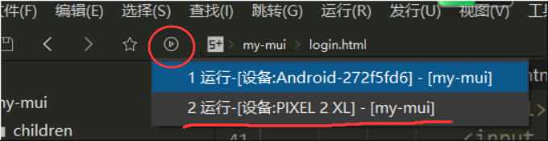

# mui代码组成部分
由于mui是移动端ui框架，所以运行与调试需要使用手机，以下给出两种运行调试方法：

## 模拟器调试
- 安装任意安卓模拟器
- 如图，点击运行按钮，等待 Hbuilder 检测到手机设备 
- 若一直加载不出来，可以尝试重启模拟器，重启 Hbuilder 再试

## 真机调试
- 手机需要打开 `开发者模式`，并启用 `usb调试`。（此处仅限 android 手机，不同手机，启用开发者模式方法不同）以下介绍大部分 android 手机通用的设置办法
    - 打开 `设置` -> `我的设备` -> `全部参数`
    - 找到手机的系统版本信息，以小米手机为例：
    - 多次点击版本信息，直到提示成功开启开发者模式
    - 返回到 `设置` 找到 `更多设置` -> `开发者选项`
    - 打开 `usb调试`，如图：
- 将手机用 usb 连接电脑
- 后续步骤和 `模拟器调试相同`
- 若一直加载不出来，可以尝试拔除 usb 连接的手机，重连并重启 Hbuilder 再试